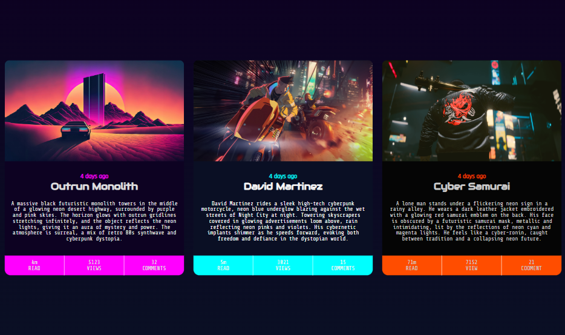

## Table of contents

- [The challenge](#the-challenge)
- [Screenshot](#screenshot)
- [Built with](#built-with)
- [Useful resources](#useful-resources)

### The challenge

Users should be able to:

- View the optimal layout for the interface depending on their device's screen size
- See hover and focus states for all interactive elements on the page

### Screenshot

### Built with

- Semantic HTML5 markup
- CSS custom properties
- Flexbox
- CSS Grid
- CSS Variables
- CSS media queries

### Useful resources

Here are some ressources if you want to dig inside the concepts used here:

- [CSS Gradients and repeating gradients](https://www.youtube.com/watch?v=4kWHW7da4U8)
- [Make your website responsive](https://youtu.be/vQDgoQKfdzM?si=cneV8TVlS-IkCG73)
- [Dont't use px for font size](https://youtu.be/xCSw6bPXZks?si=aKObSXjdqdDQvMKT)
- [Introduction to Git and Github](https://youtu.be/8Dd7KRpKeaE?si=HBCX5wXqwfdhhNAG)
